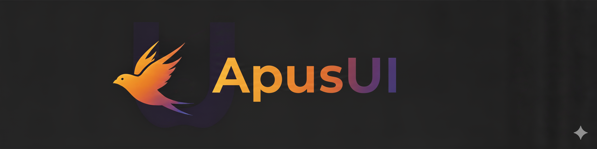

# ApusUI
ApusUI breathes Apple's Swift philosophy into UIKit with a Declarative approach, enabling you to build professional and elegant UIs with the speed and precision of the Apus (Swift bird).

## Example

Here's a quick look at how you can build a simple counter using ApusUI's declarative syntax with a `UIViewController`.
```swift
override func viewDidLoad() {
    super.viewDidLoad()
    view.subviews {
        UIStackView(.vertical) {
            UIView(.red)
            UIView(.blue)
        }
        .distribution(.fillEqually)
        .padding()
    }
}
```

## Xcode Preview

Accelerate your development with live, interactive previews in Xcode.

```swift
import SwiftUI

#Preview {
    UIViewControllerPreview {
        ViewController()
    }
}
```
